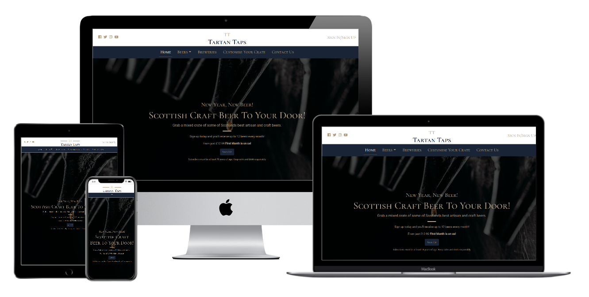
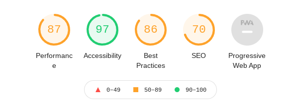
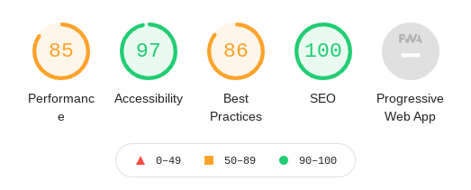

<h1 align="center">Tartan Taps Website</h1>

View the repository in GitHub [here](https://github.com/Tawnygoody/MS1-tartan-taps)

View the live project [here](https://tawnygoody.github.io/MS1-tartan-taps/index.html)

# Contents

- [User Experience (UX)](#user-experience-(ux))
    - [Strategy](#strategy)
    - [Scope](#scope)
    - [Structure](#structure)
    - [Skeleton](#skeleton)
    - [Surface](#surface)
- [Technologies Used](#technologies-used)
    - [Languages Used](#languages-used)
    - [Frameworks, Libraries & Programmes used](#frameworks-libraries-and-programmes-used)
- [Testing](#testing)
    - [W3C Validator](#w3c-validator)
    - [Testing User Stories](#testing-user-stories)
        - [Testing First Time Visitor Goals](#testing-first-time-visitor-goals)
        - [Testing Returning Visitor Goals](#testing-returning-visitor-goals)
        - [Testing Frequent User Goals](#testing-frequent-user-goals)
    - [Full Testing](#full-testing)
    - [Further Testing](#further-testing)
    - [Solved Bugs](#solved-bugs)
    - [Known Bugs](#known-bugs)
    - [Lighthouse](#lighthouse)
- [Deployment](#deployment)
    - [GitHub Pages](#github-pages)
    - [Forking the GitHub Repository](#forking-the-github-repository)
    - [Making a Local Clone](#making-a-local-clone)
- [Credits](#credits)
    - [Code](#code)
    - [Content](#content)
    - [Media](#media)
    - [Acknowledgements](#acknowledgements)

# User Experience (UX)

## Strategy

The business is a beer subscription service called Tartan Taps, which has teamed up with some of Scotland's finest craft and microbreweries, to deliver a variety of beers to the customer's doorstep. 

In this section, I have established user stories which will dictate the website functionality. The aim is to provide information on a selection of quality, great-tasting craft beers, alongside their breweries, in order to gain subscribers. 

- ### User Stories
    - #### First Time Visitor Goals
        1. As a First Time Visitor, I want to know at a glance the main purpose of Tartan Taps and what it can offer. 
        2. As a First Time Visitor, I want to be able to navigate through the website intuitively, to seek the information I require. 
        3. As a First Time Visitor, I want to locate their Social Media accounts, to determine how trusted they are. 
        4. As a First Time Visitor, I want to see prices to determine whether this a suitable product for purchase. 
    - #### Returning Visitor Goals
        1. As a Returning Visitor, I want to be able to easily sign up to start receiving my subscription.
        2. As a Returning Visitor, I want to have options to get in contact with Tartan Taps, with any queries or questions I may have. 
        3. As a Returning Visitor, I want to see customer reviews. 
    - #### Frequent User Goals
        1. As a Frequent User, I want to see what beers are available and compare them against my delivery. 
        2. As a Frequent User, I want to find information about the breweries, from where the beers came. 
        3. As a Frequent User, I want to be able to cancel / pause my subscription at any point. 
        4. As a Frequent User, I want to be able to change the amount of beers I order each month, and when I receive them.

## Scope

Based on the strategic goals that have been established, I have decided to incorporate a phased approach prioritising the most important information to less feasible concepts. 
This will allow me to manage my workload and build upon any feedback that I receive during the project. 

To begin with, the first phase would be to create a minimum viable product (MVP). 

- ### Phase 1:
    - A home page setting out what the website offers. 
    - A beer page showcasing what beers are available. 
    - A breweries page to find out more information about each brewery. 
    - A Customise your crates page. 
    - A contact us page. 

I would then build upon the MVP to further engage the user.   

- ### Phase 2: 
    - Include interactive elements to engage the user (JavaScript knowledge not yet gained)
    - Include a further option that the customer may select their beers individually. 
    - Create a Gift page, to allow users the option of a single purchase or gift subscription. 

I would then implement back end technologies (knowledge not yet gained).

- ### Phase 3:
    - Add a delivery and payments page.
    - Add an edit your order page. 

## Structure
- ### Design
    - #### Colour Scheme
        - The main colours used are Navy and Tan, which has been dictated by the Tartan Taps logo. 
        - Tartan will be used in a minimalist way to be in keeping with the company name. 
    - #### Typography
        - Cormorant SC will be used for headings and important information, in keeping with the company logo. Roboto will be utilised for the website content. Sans-serif will be used as a fallback, should there be an error with imported fonts. 
        - The text will be consistent across all pages. Titles and heading will be centered, and as there are no large bodies of text content can also be centered. 
    - #### Imagery
        - Utilising bootstraps Jumbotron the home page hero image is designed to catch the user's attention. It has to be contemporary, striking, and directly related to what the company offers.
        - Images must be of a high enough quality that as the images scale according to different devices they do not become pixelated.

## Skeleton
Below you can find links to the initial draft of the wireframes I've created for each page, showing how I would like the page to be structured, and how responsive the website is to different devices.

- ### Wireframes
    I have created wireframes using Balsamiq for desktop, tablet and mobile devices. 
    - Home Page Wireframe - [View](documentation/wireframes/home-page-wireframe.pdf)
    - Beers Wireframe - [View](documentation/wireframes/beer-wireframe.pdf)
    - Breweries Wireframe - [View](documentation/wireframes/breweries-wireframe.pdf)
    - Customise Your Crate Wireframe - [View](documentation/wireframes/crates-wireframe.pdf)
    - Contact Us Wireframe - [View](documentation/wireframes/contact-us-wireframe.pdf)
    - Sign Up Modal Wireframe - [View](documentation/wireframes/sign-up-modal-wireframe.pdf)
    - Additional Information Wireframe - [View](documentation/wireframes/additional-information-modal-wireframe.pdf) 

As the project has progressed there have been quite a few changes to what was originally laid out in the wireframes.
These changes have been made to improve the aesthetics and functionality of the website, based on feedback and my own opinion. 

Looking back I definitely feel my project would have benefited from further planning at the beginning of the project.
Having only just learnt HTML & CSS, and with a willingness to begin coding, some aspects of project planning may have been overlooked.

## Surface
- ### Features
    - #### All pages
        - Logo - Logo row will include social media links, a "Sign up / Sign In" modal, and the company logo. Social media links and modal will not display on smaller devices, and logo will also act as a link back to the home page.
        - Navbar - Toggler to a hamburger menu on smaller devices. Current page will be identified by underlining the page link, and text will be coloured white when active. 
        - Footer - Split into 3 sections - contact information, social media, and "Sign Up / Sign In" modal. Wireframes show sign up modal to not display on smaller devices, however this has been included in the project, so there is an option to sign up on all pages regardless of device size. Social media links to open in a new tab. 
        - Differing fonts between headings and content, aids in making the page look less monotonous. Cormorant SC capitalisation of letters draws the attention of the user. 
    - #### Home page
        - Jumbotron - Striking image to draw the user's attention with information relating to the company. The image will have a darker overlay to allow the text to stand out. 
        - Reviews & How it works - Circular images used to add variety, and different background colour used to identify different sections. 
        - Bootstrap Cards - Aid the user with navigation through visual images and brief descriptions. 
    - #### Beers Page
        - Dropdown option on the navbar allows the user to quickly move to different sections within beers page. Especially important when using smaller devices as a large amount of scrolling required without navigation to different sections. 
        - Beer description overlay allows for a subtle user interaction and removes the need for large amounts of text to be visible. 
        - Differing background colours to help identify different sections. 
        - Half-page hero image ties in with the bootstrap cards seen on the home page. 
    - #### Breweries Page
        - Bootstrap Cards - Image of each brewery logo to tie in with the logos seen on the beer description overlay, and a brief description about each brewery, with a link to each brewery opening in a new tab. 
        - Differing background colours to help identify different sections. 
        - Half-page hero image ties in with the bootstrap cards seen on the home page. 
    - #### Customise Your Crate Page
        - Further information modal allows user interactions and avoids large amounts of text. 
        - Simple and concise form to entice the user. This is important as large forms which take time to complete can deter the user. 
    - #### Contact Us Page
        - FAQ's section with interactive dropdowns helps to make the content appear smaller. 
        - Simple contact us form allows the user to ask any questions not already covered by FAQ's. 
        - Embedded Google Maps allows for further interaction to see exactly where Tartan Taps is located. 

# Technologies used

## Languages used
- [HTML](https://en.wikipedia.org/wiki/HTML5)
- [CSS](https://en.wikipedia.org/wiki/Cascading_Style_Sheets)

## Frameworks Libraries and Programmes used
- [Bootstrap 4.3.1](https://getbootstrap.com/docs/4.3/getting-started/introduction/)
    - Used as a framework for styling and to make the website responsive.
- [jQuery](https://jquery.com/)
    - Used with Bootstrap to make the project responsive.
- [Hover.css](https://ianlunn.github.io/Hover/) 
    - Hover.css was used in the navbar and the navbar dropdown links when being hovered over. 
- [Google fonts](https://fonts.google.com/)
    - Google Fonts was used to import the "Cormorant SC" and "Roboto" fonts used across the website.
- [Fontawesome](https://fontawesome.com/icons?d=gallery)
    - Font awesome was used to obtain the social media icons, stars for review section, and the beer glass for the Sign Up / Sign In Modal in the footer. 
- [Google Developer Tools](https://developers.google.com/web/tools) 
    - Used as a method of fixing bugs, and testing the responsiveness on different devices. 
- [Github](https://github.com/)
    - GitHub is used to store the project code after being pushed from Git.
- [Git](https://git-scm.com/) 
    - Git was used for version control by utilizing the Gitpod terminal to commit to Git and Push to GitHub.
- [Balsamiq](https://balsamiq.com/)
    - Balsamiq was used to create the wireframes, seen at the skeleton section, during the design process.
- [Reduce Images](https://www.reduceimages.com/)
    - Reduce Images was used to re-size some of the websites images to improve performance. 
- [Sauce Labs](https://saucelabs.com/)
    - Sauce Labs was utilised to complete cross-browser testing. 
- [Techsini](https://techsini.com/multi-mockup/)
    - Techsini has been utilised for website mockup. 
- [Grammarly](https://app.grammarly.com/ddocs/1040510993)
    - Grammarly has been used across the website to fix spelling errors and grammar.

# Testing 

## W3C Validator
The [W3C Markup Validator](https://validator.w3.org/) and [W3C CSS Validator](https://jigsaw.w3.org/css-validator/) Services were used to validate every page of the project to ensure there were no syntax errors in the project.
- W3C CSS Validator
    - [stle.css results](documentation/testing/validator/css-validator.png)

- W3C Markup Validator
    - [index.html results](documentation/testing/validator/index-validator.png)
    - [beers.html results](documentation/testing/validator/beers-validator.png)
    - [breweries.html results](documentation/testing/validator/breweries-validator.png)
    - [crates.html results](documentation/testing/validator/crates-validator.png)
    - [contact-us.html results](documentation/testing/validator/contact-validator.png)

## Testing User Stories
### Testing First Time Visitor Goals
1. #### As a First Time Visitor, I want to know at a glance the main purpose of Tartan Taps and what it can offer.
    - When entering the site the user is greeted with a large hero image utilising Bootstraps Jumbotron component, with a dark overlay making the text clearly visible, describing the purpose of the company. [View here](documentation/testing/first-user/jumbotron.png)
    - Below the jumbotron on the home page, there is a section for "How it Works". This is made clear using imagery and a brief description. [View here](documentation/testing/first-user/how-it-works.png)

2. #### As a First Time Visitor, I want to be able to navigate through the website intuitively, to seek the information I require. 
    - At the top of each page, there is a clear and easy to read navigation bar to take the user to each of the different pages, which compresses to a burger menu on smaller devices. The current page is highlighted by underlining each link, and the text is changed to white. [View here](documentation/testing/first-user/navbar.png)
    - The logo will take the user back to the home page when clicked. 
    - Using bootstraps "sticky-top" class the navbar will remain at the top of screen, when scrolling through the site, to avoid the need to scroll to the top of the page to view another page. [View here](documentation/testing//first-user/navbar-sticky.png)
    - Dropdown option on beers page allowing the user to quickly manoeuvre to a different section on that page. [View here](documentation/testing/first-user/navbar-dropdown.png)

3. #### As a First Time Visitor, I want to locate their Social Media accounts, to determine how trusted they are.
    - On larger devices, only social media icons (Facebook, Twitter, Instagram, Youtube) can be located to the left hand side of the logo. [View here](documentation/testing/first-user/social-logo.png)
    - On all device sizes, social media icons can be located in the footer of the site. All links to social media accounts will open in a different tab, to ensure the user does not lose access to the website. [View here](documentation/testing/first-user/social.png)

4. #### As a First Time Visitor, I want to see prices to determine whether this a suitable product for purchase.
    - The home page jumbotron shows a minimum price subscription, and a first month free message is visible in bold writing to entice the user. [View here](documentation/testing/first-user/home-price.png)
    - Further pricing options are available on the customise your crate page using a dropdown form. [View here](documentation/testing/first-user/prices.png)

### Testing Returning Visitor Goals
1. #### As a Returning Visitor, I want to be able to easily sign up to start receiving my subscription.
    - On the home screen on larger devices, the user can sign up in three places. Sign up button in the jumbotron, Sign up / Sign in to the right of the logo and a Sign up / Sign in icon in the footer. All will take the user to the same modal. [View here](documentation/testing/returning-user/sign-up.png)
    - On smaller devices, the Sign up / Sign in option to the right of the logo is removed. The user can sign up from any page using the option in the footer. [View here](documentation/testing/returning-user/sign-up-footer.png)

2. #### As a Returning Visitor, I want to have options to get in contact with Tartan Taps, with any queries or questions I may have. 
    - First option for a user to contact Tartan Taps can be located in the footer of the page, with an email address and telephone number. This appears on all device sizes. [View here](documentation/testing/returning-user/contact-us.png)
    - There is also a dedicated page to contact the company. Within this are FAQ's - if these do not fulfil the users' queries then a contact us form is available for additional enquiries. [View here](documentation/testing/returning-user/faqs-enquiry.png)

3. #### As a Returning Visitor, I want to see customer reviews.
    - The home page has a section dedicated to customer reviews. I have situated this directly below the jumbotron, so the user knows the company has a good reputation. Circular images have been used for variety, which do not display on smaller devices. [View here](documentation/testing/returning-user/reviews.png)

### Testing Frequent User Goals
1. #### As a Frequent User, I want to see what beers are available and compare them against my delivery. 
    - The beers page will show all the beers that the company offers. A brief description of each beer can be seen on the image content overlay. Descriptions have been taken from the individual breweries and edited to suit the needs of the project. [View here](documentation/testing/frequent-user/beer-overlay.png)
    - Due to the scope of the project, it has been decided that it is not necessary to show any beers which may not be in stock. 

2. #### As a Frequent User, I want to find information about the breweries, from where the beers came. 
    - A brief description / history of the brewery can be located on the breweries page, which has been split into four sections for different regions in Scotland. A link to each brewery can be found on the brewery cards which will open in a new tab. [View here](documentation/testing/frequent-user/brewery-cards.png)
    - A brewery logo thumbnail image appears on the image content overlay of the beers, to identify which brewery the beer is from. [View here](documentation/testing/frequent-user/brewery-logo.png)

3. #### As a Frequent User, I want to be able to cancel / pause my subscription at any point. 
    - I have addressed this in the FAQ's section on the contact us page, with a dropdown response explaining how this is achieved. [View here](documentation/testing/frequent-user/cancel.png)

4. #### As a Frequent User, I want to be able to change the amount of beers I order each month, and when I receive them.
    - At this stage, this is addressed in the FAQ's section on the contact us page. [View here.](documentation/testing/frequent-user/edit-order.png) In further releases, I would create an page / modal that would allow the user to edit their order online.

## Full Testing

Testing was completed using the following steps on all interactive elements of the website. [View here](documentation/testing/device-testing/testing-criteria.pdf)

## Further Testing

### Browser Compatibility
Sauce Labs was used to test the website across different browsers. The following browsers were tested:
- Google chrome - successful
- Microsoft Edge - successful
- Mozilla Firefox - successful
- Safari worked however it would not allow you to choose a date using the datepicker on the Customise Your Crate page - [seen here](documentation/testing/device-testing/safari-error.png).
- Internet Explorer 11 was the worst experience and more or less broke the website. Images were stretched, dropdown for the FAQ's were broken, text was off-centre, and the jumbotron text was completely out of alignment - [seen here](documentation/testing/device-testing/ie11-error.png)

### Google Developer Tools
Google developer tools was used throughout the project to test the responsiveness of the website across multiple device sizes. I have used Google Developer tools to simulate device sizes:
- Iphone 5 / SE: [Portrait](documentation/testing/device-testing/iphone5-p.png), [Landscape](documentation/testing/device-testing/iphone5-l.png)
- Iphone 6 / 7 / 8: [Portrait](documentation/testing/device-testing/iphone6-p.png), [Landscape](documentation/testing/device-testing/iphone6-l.png)
- Iphone X: [Portrait](documentation/testing/device-testing/iphonex-p.png), [Landscape](documentation/testing/device-testing/iphonex-l.png)
- Ipad: [Portrait](documentation/testing/device-testing/ipad-p.png), [Landscape](documentation/testing/device-testing/ipad-l.png)
- Ipad Pro: [Portrait](documentation/testing/device-testing/ipad-pro-p.png), [Landscape](documentation/testing/device-testing/ipad-pro-l.png)
- Moto G4: [Portrait](documentation/testing/device-testing/motog4-p.png), [Landscape](documentation/testing/device-testing/motog4-l.png)
- Galaxy S5: [Portrait](documentation/testing/device-testing/galaxy-p.png), [Landscape](documentation/testing/device-testing/galaxy-l.png)
- Pixel 2: [Portrait](documentation/testing/device-testing/pixel-p.png), [Landscape](documentation/testing/device-testing/pixel-l.png)
- Surface Duo: [Portrait](documentation/testing/device-testing/surface-duo-p.png), [Landscape](documentation/testing/device-testing/surface-duo-l.png)
- Galaxy Fold: [Portrait](documentation/testing/device-testing/fold-p.png), [Landscape](documentation/testing/device-testing/fold-l.png)
- Iphone 4: [Portrait](documentation/testing/device-testing/iphone4-p.png), [Landscape](documentation/testing/device-testing/iphone4-l.png)

These simulated tests only show the home page logo, navbar, and jumbotron as this is where I experienced most of issues due to the jumbotron's viewport height. As can be seen, there is no overlapping and the website is responsive for every page on all device sizes listed. 

## Solved Bugs
- The burger menu in the navbar for smaller devices would not drop down to reveal the nav-links.
    - Error: I did not have the JS popper in the correct position in the HTML docs.
    - Fix: to correct this I added the script after the footer and any modals, and before the body closing tag.
- I wanted to add a sticky-top class to the navbar so that when it was scrolled past it would stick to the top of the screen. 
    - Error: I originally had the navbar in the header section, which was inheriting properties preventing the navbar from sticking. 
    - Fix: I moved the navbar outside the header class and added a sticky-top class from bootstrap which sticks to the top of the page when scrolled past.
- The home page cards when moving from small to medium devices would display on the same row and overlap one another. 
    - Error: The col class was originally written as col-md-4, so on medium devices, 3 cards would try to fit on the same row resulting in overlapping. 
    - Fix: I corrected this to col-md-6 so that only 2 cards would display on one row on medium devices. 
    - Note: This was a common error until I got a better grasp of bootstrap's grid system. 
- Jumbotron text "New Year New Beer" was overlapping the navbar on iphone 5/SE and Galaxy Fold, when in a horizontal position on Google Dev Tools. 
    - Error: As the jumbotron's height is measured by viewport height there isn't sufficient room for all the jumbotron text to fit.
    - Fix: Max-height media queries for 320px (iphone 5 height horizontally) & 280px (Galaxy Fold height horizontally) have been added to increase the height of the jumbotron to include all the text. I could have omitted some of the jumbotron text however I did not want to do this, as it would affect the first user goal to know at a glance what the company offers.
- Home, Breweries and Customise Your crate page "cards" did not fit when testing the responsiveness on Galaxy Fold platform. 
    - Error: The width of the cards was wider than the screen width of the device. 
    - Fix: Max-width media queries for 280px, have been added which has reduced the size of the cards so they are no longer wider than the screen width. As the width of the cards have reduced this meant that text and visit website buttons were pushed out of the cards on the Breweries page. I have corrected this with an additional media query, changing the height to auto on the card body.
- Although not a bug I had a lot of repeated CSS for font-family and color due to lack of project planning at the beginning of the project.
    - Fix: I created 4 classes for text content and styled them in CSS. This resulted in 50 lines of repeated CSS removed from the style.css.
- After viewing the home page layout on "Am I responsive" I wasn't happy with how far down the screen the jumbotron text appeared and noticed that on iphone 4 the jumbotron text was overlapping the navbar. 
    - Fix: Changed the size of the jumbotron from 115vh to 100vh, to push the text back up the screen, and added additional media queries to ensure the jumbotron text does not overlap the navbar on different devices. 

## Known Bugs
- There is a tiny gap between the sticky-top navbar and the top of the screen when scrolling. This is most evident when using an iphone, showing the device frame, on chrome developer tools. 
    - There is no margin showing on google development tools, so I'm not sure why this is appearing. 

## Lighthouse
I tested my website using Lighthouse is Google Development Tools, and after some image re-sizing, this is the result I got. 

As this was my first website design I was reasonably content with the results, however I wanted to increase my SEO score from 70-100.
- The first issue identified was I did not have a meta description in the head of the HTML doc. 
- The second issue was my links to the "sign up / sign in" modal were using data-target rather than href. 
- I reduced the image sizes further to increase performance. 

Below shows the outcome of the changes made.

Despite reducing the image sizes further, the changes I have made to increase the SEO, has reduced the performance of the website slightly. 

For the scope of this project, I am happy with the results from Lighthouse, however I would like to re-visit performance and best practices to achieve a higher score. 

# Deployment

## Github pages

The project has been deployed on GitHub Pages using the following method:

1. Log into GitHub and locate the [repository](https://github.com/Tawnygoody/MS1-tartan-taps) you wish to deploy.
2. At the top of the repository click on the settings link. 
3. Scroll down the setting pages until you reach the section titled "GitHub Pages". 
4. Under the "Source" subheading click the dropdown labelled "None", select master and click save.
5. The page will then automatically refresh (it can take a while)
6. When you scroll back down through the page you will see a green bar with a tick showing that your site has been published in the "GitHub Pages" section.

## Forking the GitHub Repository

By forking the GitHub Repository to make a copy of the original repository, we can make changes without it affecting the original repository, by following these steps:

1. Log into GitHub and locate the [repository](https://github.com/Tawnygoody/MS1-tartan-taps) you wish to fork.
2. At the top-right of the repository underneath the navbar, click the "Fork" button.
3. You should now have a copy of the original repository in your account. 

## Making a Local Clone

1. Log into GitHub and locate the [repository](https://github.com/Tawnygoody/MS1-tartan-taps) you wish to clone.
2. Click the dropdown labelled "Code" to the left of the green "Gitpod" button and copy the link shown. 
3. Open Git Bash.
4. Change to the location where you want the cloned directory to be made.
5. Type "gitclone" and then paste the URL you copied in step 2. 

# Credits
## Code
- [Vclever](http://vclever.com/blog/how-to-style-a-heading-with-horizontal-lines-either-side-using-css/)
    - Helping to find a solution to get lines either side of the TT on the logo.
- [W3Schools](https://www.w3schools.com/howto/howto_css_image_overlay_title.asp) 
    - Provided the code to create a content overlay for the beer images. 
- [W3Schools](https://www.w3schools.com/css/css3_gradients.asp) 
    - Provided the code for a gradient background on the "how-it-works" section.
- [CSS Tricks](https://css-tricks.com/perfect-full-page-background-image/)
    - Aided with background images for beers, breweries, and contact us pages.
- [Matt Rudge, Code Institute](https://codeinstitute.net/)
    - Jumbotron & Jumbotron styling
    - Dark overlay which has been applied to jumbotron image and hero images.
    - Social Media Icons in footer and logo row.
- [Bootstrap](https://getbootstrap.com/docs/4.3/getting-started/introduction/)
    - Bootstrap has been used throughout the project to make the site responsive using Bootstraps Grid system and add components from their library.
- [Fontawesome](https://fontawesome.com/icons?d=gallery)
    - Fontawesome has been utilised for social media icons, reviews stars, further information modal, and the beer glass sign up / sign in modal.

## Content
Due to the nature of the website, I have relied heavily on the individual breweries for beer descriptions and brewery description / history. Some of the content has been edited for the needs of the website. 
- [West Brewery](https://www.westbeer.com/)
- [Williams Brothers](https://www.williamsbrosbrew.com/)
- [Fallen Brewing Company](https://www.fallenbrewing.co.uk/)
- [71 Brewing](https://www.71brewing.com/)
- [Stewart Brewing](https://www.stewartbrewing.co.uk/)
- [Fierce Beer](https://www.fiercebeer.com/)
- [Loch Ness Brewery](https://www.lochnessbrewery.com/)
- [Black Isle Brewing Company](https://www.blackislebrewery.com/)
- [Cromarty Brewing Company](https://www.cromartybrewing.com/)
- [Six Degrees North](https://www.sixdnorth.co.uk/)
- [Isle Of Skye Brewing Company](https://skyeale.com/)
- [The Orkney Brewery](https://www.orkneybrewery.co.uk/)
- [Isle of Arran Brewery](https://www.arranbrewery.co.uk/)
- [Islay Ales](https://www.islayales.com/)
- [Tempest Brewing Company](https://www.tempestbrewco.com/)
- [Broughton Ales](https://broughtonales.co.uk/)

All other content has been written by Christopher Goodfellow.

## Media
Images taken from Unsplash
- Home Page Jumbotron Image - [View](https://unsplash.com/photos/UTzBjrptXQo)
- Beer page Hero Image - [View](https://unsplash.com/photos/BV5YkMpFlj4)
- Breweries page Hero Image - [View](https://unsplash.com/photos/sVothhm7iRI)
- Contact Us Hero Image - [View](https://unsplash.com/photos/Cdq3ziSoeGY)
- Home page male reviewer - [View](https://unsplash.com/photos/MTZTGvDsHFY)
- Home page female reviewer - [View](https://unsplash.com/photos/_H6wpor9mjs)
- Home page how it works image 1 - [View](https://unsplash.com/photos/SpVHcbuKi6E)
- Home page how it works image 3 - [View](https://unsplash.com/photos/UErWoQEoMrc)
- Home page crates image - [View](https://unsplash.com/photos/N8TigfbRwyY)
- Lagers / IPA's - Customise your crate page - [View](https://unsplash.com/photos/NmvMhov1sYc)

Due to the nature of the website, and beers / breweries being highly specific, images have been taken from various sources which can be seen below: 

- #### Beers
    - St Mungo Lager - [View](https://www.pinterest.dk/pin/575053446141127320/)
    - Che Guava Radical Lager - [View](https://www.eebriatrade.com/products/beer/williams-bros-brewing-co/21455-che-guava-gluten-free)
    - 71 Lager - [View](https://www.eebriatrade.com/products/beer/71-brewing/7070-lager)
    - Stewarts Lager - [View](https://www.eebriatrade.com/products/beer/stewart-brewing/12268-stewarts-lager)
    - Modern Helles - [View](https://www.waitrose.com/ecom/products/tempest-modern-helles-lager/412015-731539-731540)
    - Fierce Pilsner - [View](https://www.eebriatrade.com/products/beer/fierce-beer/20133-fierce-pilsner-gf)
    - Alstadt Lager - [View](https://www.eebriatrade.com/products/beer/black-isle-brewing-company/16272-altstadt)
    - Cromarty Lager - [View](https://www.cromartybrewing.com/product/lager)
    - Hopo Lager - [View](https://www.eebriatrade.com/products/beer/broughton-ales/26783-hopo-blonde-lager)
    - Saazi Ness - [View](https://provenderbrown.co.uk/Buy-Saazi-Ness-Lager-id114378)
    - Peloton - [View](https://www.sixdnorth.co.uk/items/peloton)
    - Ceasar Augustus - [View](https://www.aldi.co.uk/caesar-augustus-lager-ipa-hybrid/p/011959257673900)
    - Skye Gold - [View](https://www.sainsburys.co.uk/gol-ui/product/isle-of-skye-skye-gold-500ml?catalogId=10241&productId=1050574&storeId=10151&langId=44&krypto=OV62aEN2YIlwxjJqrwyiIkoLh4Ri4vjHtcw9IqHQHvEgRwKDIUnLZspkRytS53O0idQKjYSbt0MJqMSOppjhYfMlPlojb1PPgdiYuvGPePU%2BNCbmyAbQP5jV7TmVJ%2B1Z&ddkey=https%3Agb%2Fgroceries%2Fisle-of-skye-skye-gold-500ml)
    - Northern Light - [View](https://www.wine-searcher.com/find/the+brewery+northern+light+pale+ale+beer+orkney+island+scotland?vintage=NV&location=uk)
    - Arran Blonde - [View](https://www.scottishfoodandhampers.co.uk/arran-blonde-beer)
    - Light Ness - [View](https://www.thecressco.co.uk/Catalogue/Ambient-A-Z/I-M/Loch-Ness-Brewery/Loch-Ness-Light-Ness-Session-Pale-Ale-39-12-x-500ml-LNB001)
    - Easy Shift - [View](https://www.eebriatrade.com/products/beer/fierce-beer/9033-easy-shift)
    - Birds & Bees - [View](https://www.eebriatrade.com/products/beer/williams-bros-brewing-co/27531-birds-bees)
    - Switch - [View](https://beertoday.co.uk/fallen-switch-1020/)
    - GPA - [View](https://www.eebriatrade.com/products/beer/west-brewery/14575-gpa-cans)
    - Saligo Golden Ale - [View](https://untappd.com/b/islay-ales-saligo-golden-ale/78450)
    - Spider Monkey - [View](https://www.royalmilewhiskies.com/black-isle-spider-monkey-ipa-5-2-33cl/)
    - Hopocrisy - [View](https://www.sixdnorth.co.uk/items/hopocrisy)
    - Hopo 6.2 IPA - [View](https://www.sainsburys.co.uk/gol-ui/product/broughton-ales-62-india-pale-ale-ipa-500ml)
    - Tin Man Tropical IPA - [View](https://www.sainsburys.co.uk/gol-ui/product/williams-bros-brewing-co-tin-man-tropical-ipa-500ml?catalogId=10241&productId=1326470&storeId=10151&langId=44&categoryId=355433&krypto=kpytQ%2FsPaAWZC0SIVp3hbKr7tdZqQsaHzX1HPWXTCwbgnC%2Fg%2Fo%2Fd4wgdE351U5EdcGjdoiUK3q9%2BSgduhD3UFK1wXHpssss1ENmAMYo6XAVveksCeKbWv9gQccUR0EfQ&ddkey=https%3Agb%2Fgroceries%2Fburns-night-%2Fwilliams-bros-brewing-co-tin-man-tropical-ipa-500ml)
    - Left Coast IPA - [View](https://www.eebriatrade.com/products/beer/71-brewing/17694-left-coast)
    - Radical Road - [View](https://www.sainsburys.co.uk/gol-ui/product/stewart-brewing-radical-road-triple-hopped-pale-ale-330ml)
    - Dark Ness - [View](https://www.thecressco.co.uk/Catalogue/Ambient-A-Z/I-M/Loch-Ness-Brewery/Loch-Ness-Dark-Ness-Stout-12-x-500ml-LNB003)
    - Skye Black - [View](https://www.dunnsfoodanddrinks.co.uk/our-range/drinks/isle-of-skye-black/)
    - Black Rock Stout - [View](https://untappd.com/b/islay-ales-black-rock-stout/3288537)
    - Mexicake - [View](https://www.eebria.com/products/beer/tempest-brewing-co/3154-mexicake)
    - Dark Island - [View](https://drizly.com/beer/ale/dark-island-500/p65646)
    - Night Shift - [View](https://www.eebriatrade.com/products/beer/fierce-beer/15180-night-shift-case-of-12)
    - Hibernator - [View](https://www.eebriatrade.com/products/beer/black-isle-brewing-company/3913-hibernator)
    - Black Hop Down - [View](https://www.cromartybrewing.com/product/black-hop-down)
    - Kelpie Seaweed Ale - [View](https://www.diffordsguide.com/beer-wine-spirits/3164/williams-bros-kelpie-seaweed-ale)
    - Chew Chew - [View](https://www.royalmilewhiskies.com/fallen-chew-chew-salted-caramel-milk-stout-6-44cl/)
    - Affogato - [View](https://www.eebriatrade.com/products/beer/stewart-brewing/32092-affogato)
    - Dark Days - [View](https://www.eebriatrade.com/products/beer/six-degrees-north/31372-dark-days-barrel-aged-stout)
- #### Brewery Logos
    - West Brewery - [View](https://twitter.com/westbeer)
    - Williams Brothers - [View](https://www.williamsbrosbrew.com/)
    - Fallen Brewing Company - [View](https://thebeer.uk/2017/11/16/fallen-brewing/)
    - 71 Brewing - [View](https://www.brewersjournal.info/the-story-of-71-brewing/)
    - Stewart Brewing - [View](https://twitter.com/stewartbrewing)
    - Fierce Beer - [View](https://www.fiercebeer.com/brewery/about-us)
    - Loch Ness Brewery - [View](https://thebeer.uk/2018/02/05/loch-ness-brewery/)
    - Black Isle Brewing Company - [View](https://twitter.com/blackislebeer)
    - Cromarty Brewing Company - [View](https://twitter.com/cromartybrewing)
    - Six Degrees North - [View](https://twitter.com/sixdnorth)
    - Isle Of Skye Brewing Company - [View](https://twitter.com/isleofskyebrew)
    - The Orkney Brewery - [View](https://www.brewerydb.com/brewery/z9kt21)
    - Isle of Arran Brewery - [View](https://twitter.com/arranbrewery)
    - Islay Ales - [View](https://twitter.com/islayales)
    - Tempest Brewing Company - [View](https://www.tempestbrewco.com/)
    - Broughton Ales - [View](https://untappd.com/BroughtonAles)
- #### Additional
    - Home page how it works image 2 - [View](https://www.independent.co.uk/news/business/google-search-local-beer-delivery-lockdown-coronavirus-customer-demand-a9687071.html)
    - Mixed Crate - Customise your crate page - [View](https://www.redh.co.uk/blog/the-difference-between-ale-and-beer/)
    - Tartan Background - [View](https://scottishshop.com/products/us-navy-tartan-sash?currency=GBP)

NOTE - As this is an internal CI project, images can be used without authorization from the image owner. 

## Acknowledgements
- My mentor, Gerard McBride for continuous helpful feedback. 
- Tutor support at Code Institue for their support. 
- Code Institute, for teaching the necessary skill to build the site. 

 
 